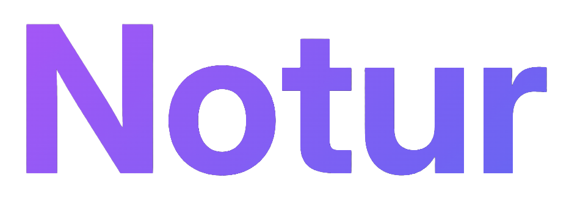

<p align="center">
  
</p>

# Notur Extension Library


A standalone extension framework for [Pterodactyl Panel](https://pterodactyl.io/) v1. Enables community-built extensions (plugins, themes, tools) that modify panel functionality without forking the source.

## Key Features

- **No per-extension rebuilds** — extensions ship pre-built JS bundles loaded at runtime
- **Clean architecture** — no sed-based injection or file patching per extension
- **One-time install** — patches React files + rebuilds once during Notur setup
- **Full lifecycle management** — install, enable, disable, update, remove via artisan
- **Interactive CLI** — beautiful terminal UI with search, wizards, and status dashboard
- **Frontend slot system** — React portal-based rendering into predefined panel locations
- **Scoped namespacing** — routes, permissions, migrations, and config are all extension-scoped
- **Registry support** — GitHub-backed extension registry with optional Ed25519 signatures

## Requirements

- Pterodactyl Panel v1.12+
- PHP 8.2+
- Node.js 22+ (matches panel requirement)
- Composer 2.x
- Package manager: npm, Yarn, pnpm, or Bun

## Example Extensions

- `examples/hello-world` -- minimal starter.
- `examples/full-extension` -- full-stack reference (backend routes, admin view, migration, frontend slot/route, tests).

## Roadmap (Next)

Near-term focus areas:

- Frontend test coverage expansion (SlotRenderWhen, CssVariables, ThemeProvider)
- Command integration tests (AddCommand, BuildCommand)
- Extension dev hot-reload (file-watcher + auto-rebuild)
- Pelican Panel compatibility investigation

See `ROADMAP.md` for the full backlog.

## Installation (into a Pterodactyl Panel)

```bash
# Option 1: Automated installer
curl -sSL https://docs.notur.site/install.sh | bash -s -- /path/to/pterodactyl

# Option 2: Manual
cd /path/to/pterodactyl
composer require notur/notur
php artisan migrate
# Then apply patches and rebuild frontend (see https://docs.notur.site/getting-started/installing)
```

## Development Setup (working on Notur itself)

```bash
# Install PHP dependencies
composer install

# Install frontend dependencies (using npm, yarn, pnpm, or bun)
npm install

# Build the bridge runtime
npm run build:bridge

# Build the SDK
npm run build:sdk

# Run PHP tests
./vendor/bin/phpunit

# Run frontend tests
npm run test:frontend
```

## Docker E2E

The repo ships with a real browser-backed E2E environment built on the existing Docker panel setup. It boots a Pterodactyl panel, installs the current Notur checkout into that panel, seeds a deterministic root admin, and runs the shell and Playwright suites against the same environment.

```bash
# Build the reusable E2E base image once.
# This is the slow dependency layer with OS packages, Node, Composer, Pterodactyl, and browser libraries.
bash docker/e2e/build-base.sh

# Run the full shell + browser E2E suite
bash docker/e2e/run-e2e.sh

# Run only the browser suite
bash docker/e2e/run-e2e.sh --suite browser

# Run the destructive Notur install/uninstall lifecycle suite
# This checks the panel before install, installs Notur, uninstalls Notur, and checks the panel again.
bash docker/e2e/run-e2e.sh --suite install-uninstall

# Keep containers running for inspection after the suite finishes
bash docker/e2e/run-e2e.sh --keep

# Force a fully fresh rebuild when debugging Docker image state
bash docker/e2e/run-e2e.sh --no-cache --rebuild-base
```

The reusable local base image is named `notur/e2e-base:php8.2-node22-panel1.12.2`. It contains the slow-moving E2E dependencies: PHP extensions, system packages, Node.js, Bun, Composer, the Pterodactyl panel tarball, and browser runtime libraries. Normal runs reuse it and only rebuild the lightweight repo-specific layers. If the base image is missing, `run-e2e.sh` fails with instructions instead of silently downloading all packages again.

GitHub Actions uses the published GHCR base image `ghcr.io/sak0a/notur-e2e-base:php8.2-node22-panel1.12.2` instead of rebuilding that slow layer on every PR. Publish or refresh it manually from the `Publish E2E Base Image` workflow after changing `docker/e2e/Dockerfile.base` or the PHP/Node/panel version tuple. The normal E2E workflow fails fast if the published base image is missing.

The default `all` suite runs the shell and browser E2E suites against a bootstrapped Notur panel. The `install-uninstall` suite is intentionally explicit because it destructively removes Notur from the panel while verifying that the underlying Pterodactyl installation remains usable.

Seeded admin credentials inside the E2E environment:

```text
Email: admin@example.com
Password: notur-admin-password
```

The browser specs live in `tests/E2E/browser/` and can also be invoked directly against an already running E2E panel with:

```bash
npm run test:e2e:browser
```

## Architecture

```
Panel Request
    └─> Laravel boots NoturServiceProvider
        └─> ExtensionManager discovers enabled extensions
            └─> Loads in dependency order (topological sort)
            └─> Registers routes, middleware, events, views, commands
            └─> Collects frontend slot data

Panel Response (HTML)
    └─> wrapper.blade.php includes notur::scripts
        └─> Outputs window.__NOTUR__ config JSON
        └─> Loads bridge.js (PluginRegistry + SlotRenderer)
        └─> Loads each extension's JS bundle
            └─> Extensions register components into slots
            └─> Bridge renders via React portals into <div id="notur-slot-*">
```

## Extension Lifecycle

```bash
php artisan notur:add acme/server-analytics   # Install from registry
php artisan notur:enable acme/server-analytics     # Enable
php artisan notur:disable acme/server-analytics    # Disable
php artisan notur:remove acme/server-analytics     # Uninstall + rollback migrations
php artisan notur:list                             # Show all installed
php artisan notur:update                           # Check for updates
php artisan notur:status                           # System status dashboard
```

## Project Structure

| Directory | Contents |
|---|---|
| `src/` | PHP runtime — Laravel service provider, extension manager, models, commands |
| `bridge/` | Frontend bridge runtime — PluginRegistry, SlotRenderer, hooks, theme |
| `sdk/` | Extension developer SDK — createExtension factory, types, scaffolding |
| `installer/` | Installer script + React patches for Pterodactyl |
| `registry/` | JSON schemas + registry build tools |
| `database/migrations/` | 4 tables: `notur_extensions`, `notur_migrations`, `notur_settings`, `notur_activity_logs` |
| `tests/` | Unit, integration, and frontend tests |

## Creating an Extension

See the [Extension Development Guide](https://docs.notur.site/extensions/guide) for the full guide.

Quick start:

```bash
php artisan notur:new acme/server-analytics
```

### Preset Definitions

- `standard`: frontend + API routes (default)
- `backend`: API routes only
- `full`: frontend + API routes + admin UI + migrations + tests
- `minimal`: backend-only scaffolding with no routes or frontend

Manual steps:
1. Create an `extension.yaml` manifest
2. Extend `NoturExtension` base class in PHP
3. Build a frontend bundle using `@notur/sdk`
4. Export with `php artisan notur:export`

## License

MIT
