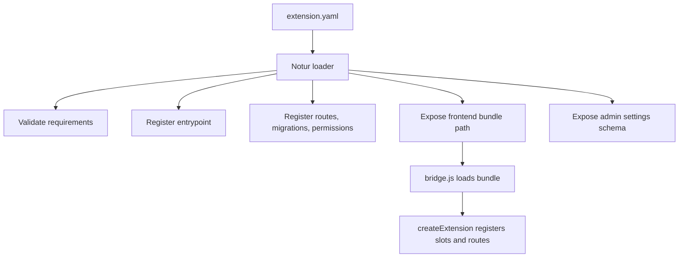
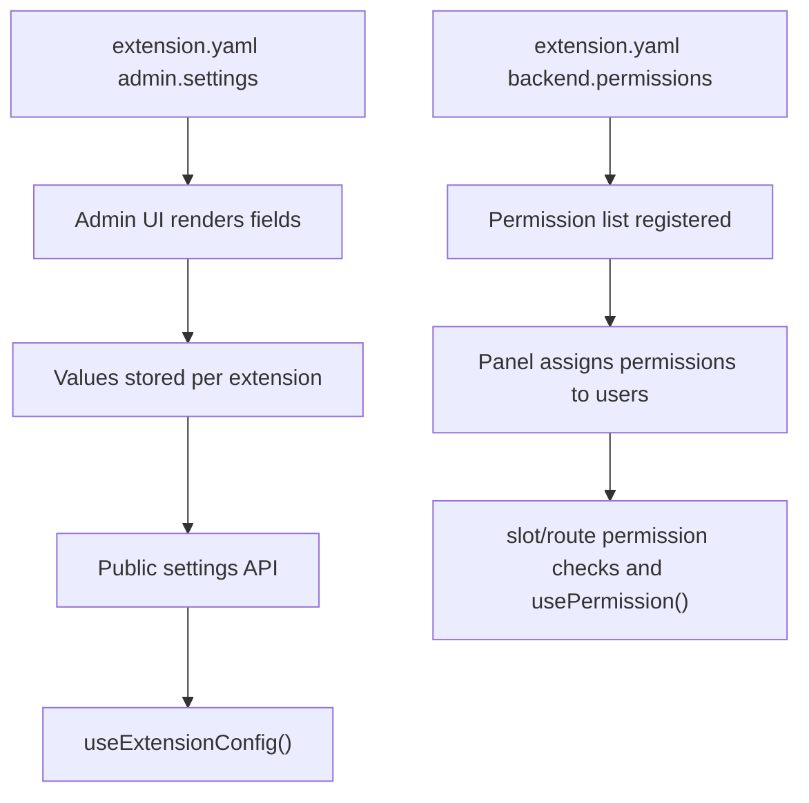
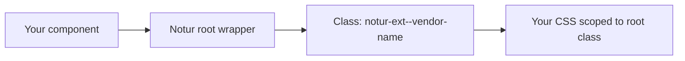
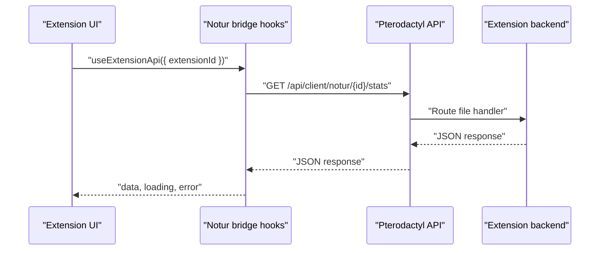

# Creating Notur Extensions

## Extension Structure

```
acme-server-analytics/
├── extension.yaml              # Manifest (required)
├── composer.json               # Optional — for Composer-based deps
├── package.json                # Optional — for frontend build
├── src/
│   ├── ServerAnalyticsExtension.php   # Entrypoint (implements ExtensionInterface)
│   ├── routes/
│   │   └── api-client.php     # API routes
│   ├── Http/
│   │   └── Controllers/
│   │       └── AnalyticsController.php
│   └── Listeners/
│       └── InitializeAnalytics.php
├── database/
│   └── migrations/
│       └── 2024_01_01_000001_create_analytics_table.php
    └── resources/
        └── frontend/
        ├── src/
        │   └── index.tsx       # Frontend entry — calls createExtension()
        └── dist/
            └── extension.js    # Pre-built bundle (shipped with extension)
```

## Scaffold with CLI (Optional)

You can scaffold a new extension with the Notur CLI:

```bash
php artisan notur:new acme/server-analytics
```

### Preset Definitions

- `standard`: frontend + API routes (default)
- `backend`: API routes only
- `full`: frontend + API routes + admin UI + migrations + tests
- `minimal`: backend-only scaffolding with no routes or frontend

### Examples
```bash
php artisan notur:new acme/server-analytics --preset=backend
php artisan notur:new acme/server-analytics --preset=full
```

Feature toggles:
```bash
php artisan notur:new acme/server-analytics --with-api-routes
php artisan notur:new acme/server-analytics --with-admin-routes
php artisan notur:new acme/server-analytics --with-admin --with-migrations --with-tests
```
Admin UI scaffolding is separate from admin routes; add `--with-admin-routes` to expose admin endpoints.

Validate your extension manifest and settings schema:
```bash
php artisan notur:validate /path/to/your-extension
```

Strict mode (treat warnings as errors):
```bash
php artisan notur:validate /path/to/your-extension --strict
```

## Step 1: Create extension.yaml

Minimal manifest (this is all you need to boot an extension now):

```yaml
notur: "1.0"
id: "acme/server-analytics"
name: "Server Analytics"
version: "1.0.0"
description: "Real-time server analytics"
license: "MIT"
```

Optional sections (only include what you need):

```yaml
requires:
  notur: "^1.0"
  pterodactyl: "^1.11"
  php: "^8.2"

# Entrypoint/autoload are optional. If omitted, Notur infers:
# - namespace + class from id (Acme\\ServerAnalytics\\ServerAnalyticsExtension)
# - psr-4 mapping to "src/"
entrypoint: "Acme\\ServerAnalytics\\ServerAnalyticsExtension"
autoload:
  psr-4:
    "Acme\\ServerAnalytics\\": "src/"

# backend routes/migrations/permissions
backend:
  routes:
    api-client: "src/routes/api-client.php"
  migrations: "database/migrations"
  permissions:
    - "analytics.view"

# frontend bundle/styles/slots
frontend:
  bundle: "resources/frontend/dist/extension.js"
  styles: "resources/frontend/dist/extension.css"
  css_isolation:
    mode: "root-class"
  slots:
    dashboard.widgets:
      component: "AnalyticsWidget"
      order: 10

# admin settings schema
admin:
  settings:
    title: "Settings"
    fields:
      - key: "enabled"
        label: "Enable Extension"
        type: "boolean"
        default: true
        public: true

# health checks + schedules
health:
  checks:
    - id: "db"
      label: "Database"
      severity: "critical"

schedules:
  tasks:
    - id: "sync"
      label: "Sync Analytics"
      command: "acme:analytics:sync"
      cron: "0 * * * *"
```

### Why the manifest exists

`extension.yaml` is the contract between your extension bundle and the Notur loader. The loader uses it to validate compatibility, discover entrypoints, wire routes, and expose frontend assets before any of your PHP or JS code runs.

Key consumers:
- The Notur loader reads it at install and boot time to register your extension.
- The admin UI reads it to build settings screens and expose public config.
- The frontend bridge reads it to know which bundles and CSS isolation settings to load.
- The CLI uses it for validation and packaging.

### Manifest fields and purpose

| Field | Consumed by | Purpose |
|---|---|---|
| `notur` | Loader | Manifest schema version. Lets the loader parse the correct structure. |
| `id` | Loader, SDK | Global unique ID. Must match `createExtension().config.id` and `ExtensionInterface::getId()`. |
| `name` | UI | Human readable display name in admin and UI surfaces. |
| `version` | Loader, UI | Used for compatibility checks, upgrades, and debug output. |
| `requires` | Loader | Hard compatibility constraints for Notur, Pterodactyl, PHP. Prevents invalid installs. |
| `capabilities` | Loader | Feature flags that enable specific subsystems like schedules and health checks (optional). |
| `entrypoint` | Loader | PHP class that boots your extension (optional; inferred from id or composer.json). |
| `autoload` | Loader | PSR-4 mapping so the entrypoint class can be loaded (optional; inferred to `src/`). |
| `backend` | Loader | Route files, migrations, and permissions used by the backend runtime (optional; defaults available). |
| `frontend` | Bridge | Frontend bundle path, CSS isolation, and slot metadata (optional; defaults available). |
| `admin` | Admin UI | Settings schema and metadata for the admin UI. |
| `health` | Health system | Declares available health checks. |
| `schedules` | Scheduler | Declares scheduled tasks with cron or schedule objects. |

### Annotated extension.yaml

```yaml
notur: "1.0" # Manifest schema version
id: "acme/server-analytics" # Global unique ID
name: "Server Analytics" # Display name
version: "1.0.0" # Semver version
description: "Real-time server analytics"

authors:
  - name: "Your Name"
license: "MIT"

requires:
  notur: "^1.0" # Minimum Notur runtime
  pterodactyl: "^1.11" # Panel compatibility
  php: "^8.2" # PHP runtime requirement

capabilities:
  routes: "^1"
  health: "^1"
  schedules: "^1"
  css_isolation: "^1"

entrypoint: "Acme\\ServerAnalytics\\ServerAnalyticsExtension" # Optional (inferred if missing)

autoload:
  psr-4:
    "Acme\\ServerAnalytics\\": "src/" # Optional (inferred if missing)

backend:
  routes:
    api-client: "src/routes/api-client.php"
  migrations: "database/migrations"
  permissions:
    - "analytics.view"

frontend:
  bundle: "resources/frontend/dist/extension.js" # Optional (defaults to common paths)
  css_isolation:
    mode: "root-class"
  slots:
    server.subnav:
      label: "Analytics"
      icon: "chart-bar"
      permission: "analytics.view"

admin:
  settings:
    title: "Settings"
    fields:
      - key: "enabled"
        label: "Enable Extension"
        type: "boolean"
        default: true
        public: true

health:
  checks:
    - id: "db"
      label: "Database"
      severity: "critical"

schedules:
  tasks:
    - id: "sync"
      label: "Sync Analytics"
      command: "acme:analytics:sync"
      cron: "0 * * * *"
```

### Critical alignment rules

If these drift, your extension will load partially or not at all.

- `extension.yaml` `id` must equal `ExtensionInterface::getId()`.
- `extension.yaml` `id` must equal `createExtension({ config: { id } })`.
- If you provide `createExtension({ config: { name, version } })`, they should match the manifest (or omit them to auto-fill).
- `frontend.bundle` must match your build output path (or use a default path like `resources/frontend/dist/extension.js`).
- If `entrypoint` is present, it must point to a class that implements `ExtensionInterface` (otherwise it is inferred).

### How Notur uses the manifest



### Settings and permissions flow



### Admin Settings Schema

Settings defined under `admin.settings` are rendered in the Notur admin UI and persisted per extension.

Supported field types:
- `string`
- `text`
- `number`
- `boolean`
- `select`

Optional field properties:
- `label`
- `required`
- `default`
- `help` (or `description`)
- `placeholder`
- `input` (e.g. `text`, `email`, `password`, `url`, `color`)
- `options` (for `select`, list of `{ value, label }`)
- `public` (expose to frontend via `useExtensionConfig`)

## Capabilities

Capabilities declare which Notur features your extension opts into. Each capability is versioned
using a major-only constraint (e.g. `^1`, `1`, `>=1`). If the `capabilities` section is present,
any capability not explicitly listed is treated as disabled. If `capabilities` is omitted, Notur
enables routes by default and automatically enables `health`/`schedules` when their config blocks
are present.

Common capability IDs:
- `routes` — backend route registration
- `health` — health check reporting
- `schedules` — scheduled tasks
- `css_isolation` — frontend CSS isolation helper

## Health Checks

Use `health.checks` to declare check metadata, and implement `HasHealthChecks` to return results.

```yaml
health:
  checks:
    - id: "db"
      label: "Database"
      description: "Checks analytics database connectivity."
      severity: "critical"
```

```php
use Notur\Contracts\HasHealthChecks;

class ServerAnalyticsExtension implements HasHealthChecks
{
    public function getHealthChecks(): array
    {
        return [
            [
                'id' => 'db',
                'status' => 'ok',
                'message' => 'Database reachable',
            ],
        ];
    }
}
```

## Scheduled Tasks

Use `schedules.tasks` to declare scheduled commands. Each task requires an `id`, `label`,
and `command`. You can use either a `cron` expression or a `schedule` object.
If you declare `capabilities`, include `schedules: "^1"` or schedules will be ignored.
If both `cron` and `schedule` are provided, `cron` takes precedence.

```yaml
schedules:
  tasks:
    - id: "sync"
      label: "Sync Analytics"
      command: "acme:analytics:sync"
      cron: "0 * * * *"
      without_overlapping: true
```

Schedule object examples:

```yaml
schedules:
  tasks:
    - id: "hourly"
      label: "Hourly Sync"
      command: "acme:analytics:sync"
      schedule:
        type: "hourly"

    - id: "daily"
      label: "Daily Report"
      command: "acme:analytics:report"
      schedule:
        type: "dailyAt"
        at: "02:30"
```

Supported schedule types:
- `hourly`
- `daily`
- `dailyAt` (requires `at`)
- `weeklyOn` (requires `day` as `mon`..`sun` and `at`)
- `everyMinutes` (requires `interval`)
- `everyHours` (requires `interval`)

## CSS Isolation

Use `frontend.css_isolation` to enable the root-class scoping helper. When enabled, Notur wraps
each rendered component in a root element with a class like `notur-ext--vendor-name`.

Why it matters:
- It prevents your component styles from leaking into the panel UI.
- It allows you to scope all your CSS under a predictable root class.
- It avoids collisions between multiple extensions shipping similarly named classes.

```yaml
frontend:
  css_isolation:
    mode: "root-class"
    class: "notur-ext--acme-analytics" # optional override
```



## Troubleshooting extension.yaml

- Extension not loading: ensure `id` matches `ExtensionInterface::getId()` and `createExtension().config.id`.
- Routes return 404: ensure you have route files in `src/routes/*`, or define `backend.routes`, or implement `HasRoutes`.
- Frontend not rendering: ensure your bundle exists at `resources/frontend/dist/extension.js` (or set `frontend.bundle`).
- `useExtensionConfig` returns empty: ensure settings fields are marked `public: true`.
- CSS isolation not applied: ensure `frontend.css_isolation` is present or `createExtension({ cssIsolation: true })`.
- Admin settings not visible: ensure `admin.settings` has `fields` and the extension is installed.

## Step 2: Implement the PHP Entrypoint

```php
<?php

namespace Acme\ServerAnalytics;

use Notur\Contracts\ExtensionInterface;
use Notur\Contracts\HasRoutes;
use Notur\Contracts\HasMigrations;
use Notur\Contracts\HasFrontendSlots;

class ServerAnalyticsExtension implements ExtensionInterface, HasRoutes, HasMigrations, HasFrontendSlots
{
    public function getId(): string { return 'acme/server-analytics'; }
    public function getName(): string { return 'Server Analytics'; }
    public function getVersion(): string { return '1.0.0'; }
    public function getBasePath(): string { return __DIR__ . '/..'; }

    public function register(): void
    {
        // Bind services, configure settings
    }

    public function boot(): void
    {
        // Post-registration logic
    }

    public function getRouteFiles(): array
    {
        return ['api-client' => 'src/routes/api-client.php'];
    }

    public function getMigrationsPath(): string
    {
        return $this->getBasePath() . '/database/migrations';
    }

    public function getFrontendSlots(): array
    {
        return [
            'server.subnav' => ['label' => 'Analytics', 'icon' => 'chart-bar'],
            'dashboard.widgets' => ['component' => 'AnalyticsWidget', 'order' => 10],
        ];
    }
}
```

### Available Contracts

Implement these interfaces to opt into capabilities:

| Interface | Purpose |
|---|---|
| `ExtensionInterface` | Required — base contract |
| `HasRoutes` | Register route files |
| `HasMigrations` | Database migrations |
| `HasCommands` | Artisan commands |
| `HasMiddleware` | HTTP middleware |
| `HasEventListeners` | Event listeners |
| `HasBladeViews` | Blade view namespace |
| `HasFrontendSlots` | Frontend slot metadata |

## Step 3: Create API Routes

```php
// src/routes/api-client.php
use Illuminate\Support\Facades\Route;
use Acme\ServerAnalytics\Http\Controllers\AnalyticsController;

// These routes are automatically prefixed with:
// /api/client/notur/acme/server-analytics/

Route::get('/stats', [AnalyticsController::class, 'stats']);
Route::get('/export', [AnalyticsController::class, 'export']);
```

Route groups and their prefixes:

| Group | Prefix | Default Middleware |
|---|---|---|
| `api-client` | `/api/client/notur/{extension-id}/` | `client-api` |
| `admin` | `/admin/notur/{extension-id}/` | `web`, `admin` |
| `web` | `/notur/{extension-id}/` | `web` |

### Request flow for extension APIs



## Step 4: Build the Frontend

### Install the SDK

```bash
bun install @notur/sdk
```

### Create the Frontend Entry

```tsx
// resources/frontend/src/index.tsx
import * as React from 'react';
import { createExtension } from '@notur/sdk';

// Access the Notur bridge hooks
const { useExtensionApi, useExtensionState } = window.__NOTUR__.hooks;

const AnalyticsWidget: React.FC<{ extensionId: string }> = ({ extensionId }) => {
    const api = useExtensionApi({ extensionId });
    const [data, setData] = React.useState(null);

    React.useEffect(() => {
        api.get('/stats').then(setData);
    }, []);

    return (
        <div style={{ padding: '1rem', background: 'var(--notur-bg-secondary)', borderRadius: 'var(--notur-radius-md)' }}>
            <h3 style={{ color: 'var(--notur-text-primary)' }}>Server Analytics</h3>
            {data ? <pre>{JSON.stringify(data, null, 2)}</pre> : <p>Loading...</p>}
        </div>
    );
};

const AnalyticsPage: React.FC = () => {
    return <div>Full analytics page here</div>;
};

// Register the extension
createExtension({
    config: {
        id: 'acme/server-analytics',
        name: 'Server Analytics',
        version: '1.0.0',
    },
    slots: [
        { slot: 'dashboard.widgets', component: AnalyticsWidget, order: 10 },
    ],
    routes: [
        { area: 'server', path: '/analytics', name: 'Analytics', component: AnalyticsPage },
    ],
});
```

### Build with Webpack

Use the SDK's base config or your own:

```js
// webpack.config.js
const base = require('@notur/sdk/webpack.extension.config');
module.exports = {
    ...base,
    entry: './resources/frontend/src/index.tsx',
    output: {
        ...base.output,
        filename: 'extension.js',
    },
};
```

```bash
bunx webpack --mode production
```

The built bundle goes to `resources/frontend/dist/extension.js`.

**React and ReactDOM are externalized** — your bundle uses the panel's existing React instance via `window.React` and `window.ReactDOM`. Do not bundle React.

## Step 5: Test Locally

```bash
# Link your extension for development
cd /var/www/pterodactyl
php artisan notur:dev /path/to/acme-server-analytics

# Your extension is now symlinked and active
# PHP changes take effect immediately
# Frontend changes require rebuilding the JS bundle
```

Watch mode (rebuilds the frontend bundle on change):

```bash
php artisan notur:dev /path/to/acme-server-analytics --watch
```

## Step 6: Export and Distribute

```bash
# Create a .notur archive
php artisan notur:export /path/to/acme-server-analytics

# Output: acme-server-analytics-1.0.0.notur
# Also generates: .sha256 checksum file
```

Users install with:
```bash
php artisan notur:install /path/to/acme-server-analytics-1.0.0.notur
```

## Available Frontend Slots

| Slot ID | Location | Type |
|---|---|---|
| `navbar` | Top navigation bar | Component portal |
| `navbar.left` | Navbar left (near logo) | Component portal |
| `server.subnav` | Server sub-navigation | Nav items |
| `server.header` | Server header area | Component portal |
| `server.page` | Server area | Full route/page |
| `server.footer` | Server footer area | Component portal |
| `server.terminal.buttons` | Terminal power buttons | Component portal |
| `server.console.header` | Console page header | Component portal |
| `server.console.sidebar` | Console sidebar area | Component portal |
| `server.console.footer` | Console page footer | Component portal |
| `server.files.actions` | File manager toolbar | Component portal |
| `server.files.header` | File manager header | Component portal |
| `server.files.footer` | File manager footer | Component portal |
| `dashboard.header` | Dashboard header area | Component portal |
| `dashboard.widgets` | Dashboard below server list | Component portal |
| `dashboard.serverlist.before` | Before dashboard server list | Component portal |
| `dashboard.serverlist.after` | After dashboard server list | Component portal |
| `dashboard.footer` | Dashboard footer area | Component portal |
| `dashboard.page` | Dashboard area | Full route/page |
| `account.header` | Account header area | Component portal |
| `account.page` | Account area | Full route/page |
| `account.footer` | Account footer area | Component portal |
| `account.subnav` | Account sub-navigation | Nav items |

## Available Hooks

From the bridge runtime (`window.__NOTUR__.hooks`):

| Hook | Purpose |
|---|---|
| `useSlot(slotId)` | Get all components registered for a slot |
| `useExtensionApi({ extensionId })` | HTTP client scoped to your extension's API routes |
| `useExtensionState(extensionId, initialState)` | Shared state across your extension's components |
| `useNoturTheme()` | Access CSS custom properties / theme |

From the SDK (`@notur/sdk`):

| Hook | Purpose |
|---|---|
| `useServerContext()` | Current server UUID, name, permissions |
| `useUserContext()` | Current user info |
| `usePermission(permission)` | Check if user has a specific permission |

## Theming

Extensions can use CSS custom properties for consistent styling:

```css
.my-widget {
    background: var(--notur-bg-secondary);
    color: var(--notur-text-primary);
    border-radius: var(--notur-radius-md);
    font-family: var(--notur-font-sans);
}
```

Theme extensions can override these variables by shipping a CSS file that redefines `:root` properties.
